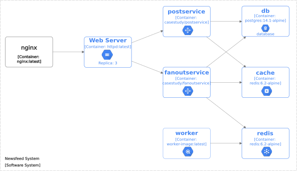

# A case study on system architectural diagrams
This repository contains the files produced and used in the context of a case study on building architectural system diagrams. First, we describe a newsfeed system like Facebook or Instagram and show a high-level diagram depicting the system's architecture. We then implement system descriptors using Docker Compose. The newsfeed application described in ... \cite{xu2020} inspired the authors.

## A newsfeed system design

A news feed is a list of newly published content on a website. End users can receive push updates for new content on a website by subscribing to the website's news feed. Xu [^1] describes a newsfeed system in detail. 

Let us assume a newsfeed system like Facebook, Instagram, or Twitter. This newsfeed system contains two streams: feed publishing and newsfeed retrieval. The feed publishing stream allows users to publish posts, and the retrieval stream summarizes friends' posts in reverse chronological order. The newsfeed system stores the corresponding post data in the database or in the cache.

The user creates a post via the publishing service, where a news feed publishing API takes the user's authentication details and the post data (text, photos, or videos). Then a _fanout service_ pushes the new content to friends' news feeds. We call _fanout service_ the process of forwarding a post to all followers.

A modeling suggestion for this system is to design it as in Figure {@fig:newsfeed-system-adhoc-xu-diagram}, 
which shows the high-level system architecture. The system components are as follows:

- Load Balancer: distributes the load of requests among the web servers.
- Web server: maintains connections with users, forwards traffic to various services, and performs user authentication.
- Post Service: takes care of persistence of user posts in the database and cache.
- Fanout service: forwards new content to the feed of friends and followers.

![High-level architecture of a newsfeed system. Diagram from [^1]](img/architectural-diagram-adhoc-xu.png){#fig:newsfeed-system-adhoc-xu-diagram}

The Fanout service uses a communication structure based on the publisher/subscriber pattern. In this context, it is widespread for the developer to use an implemented solution to satisfy the need for message exchange between system components. Some market-ready platforms that implement this concept of producer and consumer are Apache Kafka, ActiveMQ, and Redis.

## A newsfeed system descriptor

Using the description and the architectural diagram, we created a Docker Compose descriptor. Listing 1 depicts the system components according to the Docker Compose description language. See the file [docker-compose.yml](docker-compose.yml) for full code.

Note that the _nginx_ _service_ (see line 2 in Listing 1) has the role of load balancing according to the system description, although the Docker Compose descriptor does not contain this information. This issue affects the creation of the meta-descriptor, as it is not possible to assign missing information.

```
services:
  nginx:
    image: nginx:latest
    restart: always
    volumes:
      - ./nginx.conf:/etc/nginx/nginx.conf:ro
    depends_on:
      - webserver
  webserver:
    image: httpd:latest
    container_name: webserver
    hostname: webserver01
    deploy:
      mode: replicated
      replicas: 3
```
Listing 1: Docker Compose newsfeed system descriptor.


Table 1 also summarizes all Docker services created for the newsfeed system and some important aspects of these services. So we see that Docker Composer has eight services specified. Moreover, some of these services are linked via the _depends_on_ property, creating a dependency relationship between them.

| Services      | Image                     | Depends\_on      | Deploy      |
|---------------|---------------------------|------------------|-------------|
| nginx         | nginx:latest              | webserver        |             |
| webserver     | emondek/simple-api:latest |                  | replicas: 3 |
| db            | postgres:14.1-alpine      |                  |             |
| cache         | redis:6.2-alpine          |                  |             |
| postservice   | emondek/simple-api:latest | db, cache        |             |
| fanoutservice | emondek/simple-api:latest | db, cache, redis |             |
| redis         | redis:6.2-alpine          |                  |             |
| worker        | app-image:latest          | redis            | replicas: 3 |
Table 1: Docker Compose services for newsfeed system

## Transformation P1

If we use the system descriptor in Listing 1 as input to the algorithm,  we get the meta-descriptor in Listing 2. This task corresponds to process P1 in our approach.

We show only a fragment of the code generated for the meta-descriptor in Listing 2. The complete code is available at [meta-descriptor.yaml](meta-descriptor.yaml). Comparing the _nginx_ service from Listing 1 with the _nginx_ component of the meta-descriptor, we see that the algorithm capture the essential elements for generating the architecture diagram.

```
components:
  nginx
    name: nginx
    properties:
      volumes:
        - ./nginx.conf:/etc/nginx/nginx.conf:ro
    artifacts:
      name: nginx:latest

relations: 
  - out: nginx
    in: webserver
  - out: postservice,
    in: db
``` 
Listing 2: Newsfeed System meta-descriptor

## Transformation P2 and rendering
We have chosen to use an automated tool for rendering the diagram. For this reason, the P2 process of our approach generates a diagram-as-code artifact that corresponds to the DSL language of the Structurizr tool. Listing 3 presents a fragment of the Diagram-as-code model.

```
workspace {
    model {
        softwareSystem = softwareSystem "Newsfeed System" {
            nginx = container "nginx" "" "nginx:latest"{}
            webserver = container "Web Server"  "Replica: 3" "httpd:latest" "Replicas: 3"{}
            db = container "db" "database" "postgres:14.1-alpine"  {}
            cache = container "cache" "" "redis:6.2-alpine"{}
            
            nginx -> webserver1 "depends_on"
            postservice -> db "depends_on"
            postservice -> cache "depends_on"
        }
    }
...
```
Listing 3: Newsfeed System Diagram-as-code model

Finally, from the DaC model, the Structurzr tool generates the diagram in Figure 2.




[^1]: A. Xu. 2020. System Design Interview: An Insider’s Guide. Independently Published. https://books.google.ca/books?id=TZWmzQEACAAJ